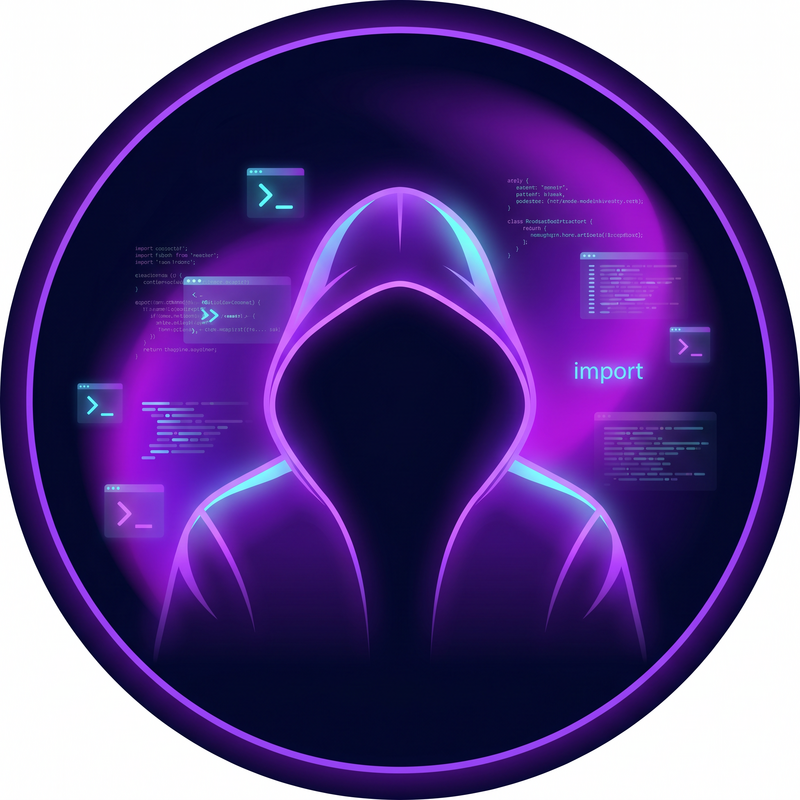

<!-- ═══════════════════════════════════════════════════════════════ -->
<!--          🌌 NAUSEA · NEON BACKEND EDITION 🌌                     -->
<!-- ═══════════════════════════════════════════════════════════════ -->


<!-- ═══════════════════════ HERO / AVATAR ═══════════════════════ -->

<table>
  <tr>
    <td width="38%" align="center">
      
    </td>
    <td width="62%" align="left">
      
      <br><br>
      
      
      
      
      <br><br>
      
      
    </td>
  </tr>
</table>

<br>

<!-- ═══════════════════════ ABOUT ═══════════════════════ -->

##  About Me

```python
class Nausea:
    def __init__(self):
        self.role     = "Backend Developer"
        self.code     = ["Python", "Go", "Bash"]
        self.focus    = ["Backend", "Automation", "Databases"]
        self.mindset  = "Reliable. Maintainable. Clean."
        self.coffee   = float("inf")

    def vibe(self) -> str:
        return "Turning ideas into solid backend systems 🚀"
```

<table>
  <tr>
    <td>💜</td><td>I'm a <b>Backend Developer</b> who builds <b>reliable &amp; maintainable</b> software.</td>
  </tr>
  <tr>
    <td>🐍</td><td>My main language is <b>Python</b> — I love crafting <b>backend services</b>, <b>automation tools</b> &amp; <b>practical projects</b>.</td>
  </tr>
  <tr>
    <td>🌱</td><td>Always learning, always exploring the depths of <b>Linux</b>.</td>
  </tr>
  <tr>
    <td>🎯</td><td>I care about <b>clean architecture</b>, <b>performance</b> &amp; <b>code that lasts</b>.</td>
  </tr>
</table>

<br>

<!-- ═══════════════════════ TECH STACK ═══════════════════════ -->

##  Tech Stack

<div align="center">

#### 💻 Languages


#### ⚡ Backend &amp; Frameworks


#### 🗄️ Databases


#### 🛠️ Tools &amp; Platforms


</div>

<br>

<!-- ═══════════════════════ WHAT I DO ═══════════════════════ -->

##  What I Do

<table align="center">
  <tr>
    <td align="center" width="25%">
      <br>
      <b>⚙️ Backend</b><br>
      <sub>Scalable systems</sub>
    </td>
    <td align="center" width="25%">
      <br>
      <b>🤖 Automation</b><br>
      <sub>Smart tools</sub>
    </td>
    <td align="center" width="25%">
      <br>
      <b>🗄️ Databases</b><br>
      <sub>Efficient design</sub>
    </td>
    <td align="center" width="25%">
      <br>
      <b>🐧 Linux</b><br>
      <sub>Terminal master</sub>
    </td>
  </tr>
</table>

<br>

<!-- ═══════════════════════ STATS ═══════════════════════ -->

##  GitHub Analytics

<div align="center">


<br><br>


<br><br>


</div>

<br>

<!-- ═══════════════════════ TROPHIES ═══════════════════════ -->

##  Trophies

<div align="center">
  
</div>

<br>

<!-- ═══════════════════════ QUOTE ═══════════════════════ -->

<div align="center">
  
</div>

<br>

<!-- ═══════════════════════ CONNECT ═══════════════════════ -->

##  Let's Connect

<div align="center">

<a href="https://github.com/nausea"></a>
<!-- <a href="mailto:you@email.com"></a> -->
<!-- <a href="#"></a> -->
<!-- <a href="#"></a> -->

</div>

<br>

<div align="center">
  <i>💜 “Reliable. Maintainable. Clean.” — that's the way.</i>
</div>


